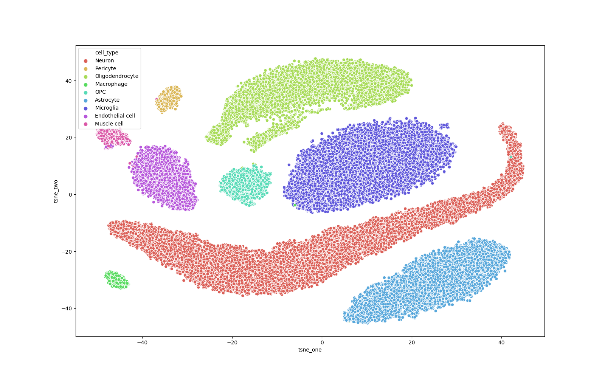

This folder contain the supplementary figures in the first experiment

# t-SNE embedding of Human Pancreas with 15% and 20% labels

# t-SNE embedding of Mouse Brain with 15% and 20% labels

# t-SNE embedding of Mouse Retina with 15% and 20% labels

# t-SNE embedding of Human Pancreas with 15% label and 200 genes

# t-SNE embedding of Mouse Brain with 15% label and 200 genes

# t-SNE embedding of Mouse Retina with 15% label and 200 genes
